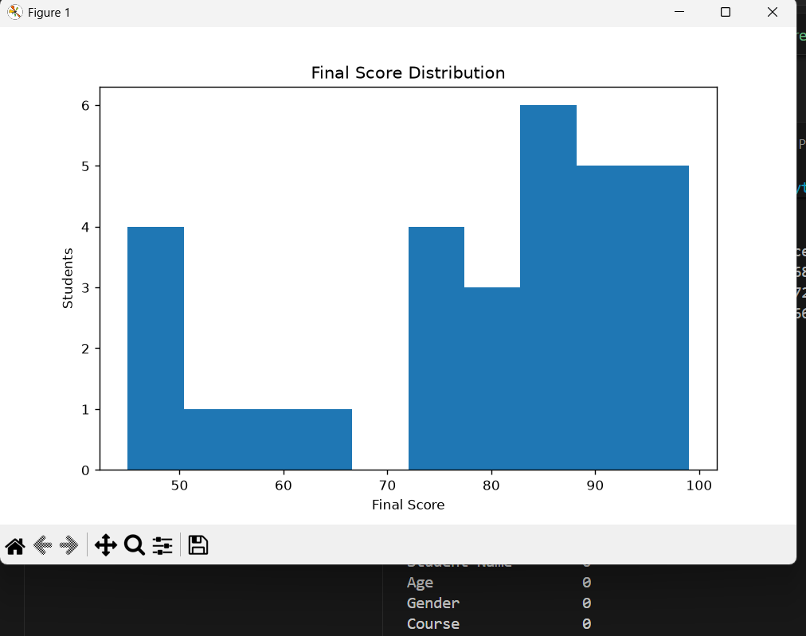
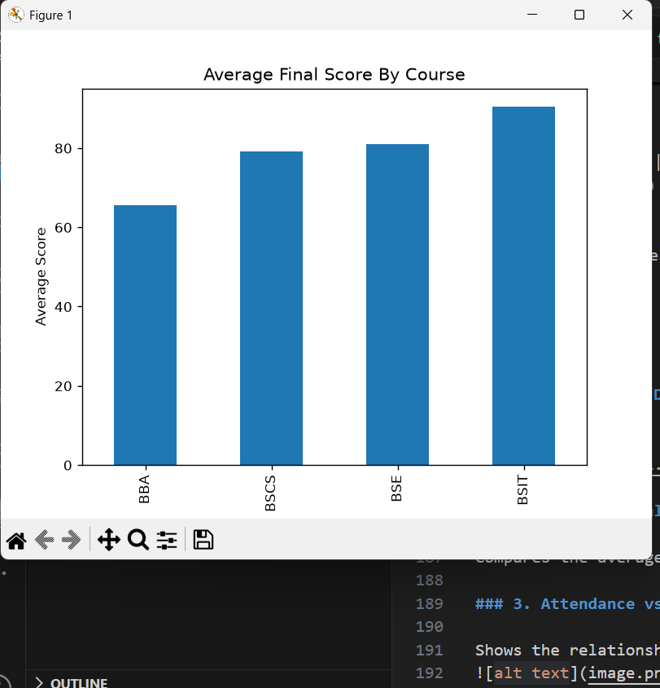
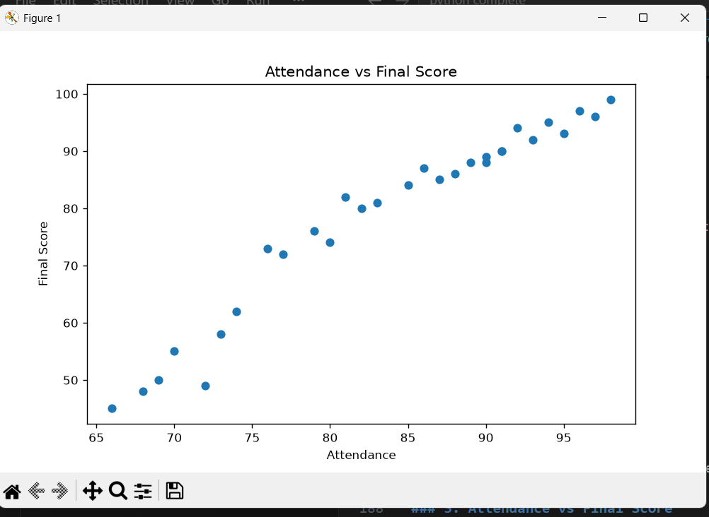

# Day 3 Internship Task

# 📊 Student Performance Analysis - Python Code

```python
# Import important libraries
import pandas as pd
import matplotlib.pyplot as plt

# Load dataset
df = pd.read_csv("student_dataset.csv")

print("=" * 60)
print("STUDENT PERFORMANCE DATASET")
print("=" * 60)

print(df.head())

# Display basic information about the dataset
print("\nDataset Information")
print(df.info())

print("\nShape")
print(df.shape())

print("\nColumns")
print(df.columns)

print("\nSummary")
print(df.describe())

# Calculate average scores
print("\nAverage Scores")

print("Assignment Average:",
      df["Assignment Score"].mean())

print("Midterm Average:",
      df["Midterm Score"].mean())

print("Final Average:",
      df["Final Score"].mean())

# Find highest and lowest scores
print("\nHighest Final Score")

print(df[df["Final Score"] ==
      df["Final Score"].max()])

print("\nLowest Final Score")

print(df[df["Final Score"] ==
      df["Final Score"].min()])

# Students with attendance below 75%
low_attendance = df[df["Attendance"] < 75]

print("\nStudents Below 75% Attendance")

print(low_attendance)

# Students at risk of failing
risk_students = df[df["Final Score"] < 50]

print("\nStudents At Risk")

print(risk_students)

# Average final score by course
course_average = df.groupby("Course")["Final Score"].mean()

print("\nAverage Final Score by Course")

print(course_average)

# Relationship between attendance and final score
correlation = df["Attendance"].corr(df["Final Score"])

print("\nCorrelation")

print(correlation)

# Check missing values
print(df.isnull().sum())

# Replace missing values
df.fillna(df.mean(numeric_only=True), inplace=True)

# Remove duplicate values
df.drop_duplicates(inplace=True)

# -----------------------------
# Visualization 1
# Final Score Distribution
# -----------------------------
plt.figure(figsize=(8,5))

plt.hist(df["Final Score"], bins=10)

plt.title("Final Score Distribution")
plt.xlabel("Final Score")
plt.ylabel("Students")

plt.show()

# -----------------------------
# Visualization 2
# Average Final Score by Course
# -----------------------------
course_average.plot(kind="bar")

plt.title("Average Final Score By Course")
plt.xlabel("Course")
plt.ylabel("Average Score")

plt.show()

# -----------------------------
# Visualization 3
# Attendance vs Final Score
# -----------------------------
plt.figure(figsize=(8,5))

plt.scatter(df["Attendance"],
            df["Final Score"])

plt.title("Attendance vs Final Score")

plt.xlabel("Attendance")
plt.ylabel("Final Score")

plt.show()
```

# 📊 Student Performance Analysis Using Python & Pandas

## Student Performance Dataset

```
============================================================
STUDENT PERFORMANCE DATASET
============================================================
```

### First 5 Records

| Student Name | Age | Gender | Course | Attendance | Assignment Score | Midterm Score | Final Score |
|--------------|----:|--------|--------|-----------:|-----------------:|--------------:|------------:|
| Ali | 20 | Male | BSCS | 90 | 85 | 80 | 88 |
| Ahmed | 21 | Male | BBA | 70 | 60 | 58 | 55 |
| Fatima | 19 | Female | BSIT | 95 | 90 | 91 | 93 |
| Ayesha | 22 | Female | BSE | 82 | 78 | 75 | 80 |
| Bilal | 20 | Male | BSCS | 68 | 55 | 50 | 48 |

---

# Dataset Information

```text
<class 'pandas.DataFrame'>

RangeIndex: 30 entries, 0 to 29

Data columns (total 8 columns)

0  Student Name
1  Age
2  Gender
3  Course
4  Attendance
5  Assignment Score
6  Midterm Score
7  Final Score

Memory Usage: 2.0 KB
```

---

# Dataset Shape

```python
(30, 8)
```

---

# Dataset Columns

```python
Index([
'Student Name',
'Age',
'Gender',
'Course',
'Attendance',
'Assignment Score',
'Midterm Score',
'Final Score'
], dtype='object')
```

---

# Statistical Summary

| Statistic | Age | Attendance | Assignment | Midterm | Final |
|-----------|----:|-----------:|-----------:|---------:|------:|
| Count | 30 | 30 | 30 | 30 | 30 |
| Mean | 20.63 | 83.73 | 78.33 | 76.27 | 78.60 |
| Std | 1.22 | 9.53 | 13.05 | 13.86 | 16.43 |
| Min | 19 | 66 | 52 | 49 | 45 |
| 25% | 20 | 76.25 | 70.25 | 68.25 | 72.25 |
| 50% | 20.5 | 85.5 | 82.5 | 80 | 84.5 |
| 75% | 21.75 | 91 | 88 | 86.75 | 90 |
| Max | 23 | 98 | 96 | 95 | 99 |

---

# Average Scores

| Category | Average |
|----------|--------:|
| Assignment Score | **78.33** |
| Midterm Score | **76.27** |
| Final Score | **78.60** |

---

# Highest Final Score

| Student | Final Score |
|---------|------------:|
| **Iqra** | **99** |

---

# Lowest Final Score

| Student | Final Score |
|---------|------------:|
| **Yasir** | **45** |

---

# Students Below 75% Attendance

| Student | Attendance |
|---------|-----------:|
| Ahmed | 70% |
| Bilal | 68% |
| Usman | 72% |
| Talha | 74% |
| Danish | 69% |
| Adnan | 73% |
| Yasir | 66% |

---

# Students At Risk of Failing

| Student | Final Score |
|---------|------------:|
| Bilal | 48 |
| Usman | 49 |
| Yasir | 45 |

---

# Average Final Score By Course

| Course | Average Final Score |
|--------|--------------------:|
| BBA | 65.63 |
| BSCS | 79.13 |
| BSE | 81.00 |
| BSIT | 90.43 |

---

# Correlation Between Attendance and Final Score

```python
0.9701456743057889
```

### Interpretation

A correlation value of **0.97** indicates a **very strong positive relationship** between attendance and final score.

Students with higher attendance generally achieve higher final exam scores.

---

# Missing Values

| Column | Missing Values |
|--------|---------------:|
| Student Name | 0 |
| Age | 0 |
| Gender | 0 |
| Course | 0 |
| Attendance | 0 |
| Assignment Score | 0 |
| Midterm Score | 0 |
| Final Score | 0 |

✅ No missing values were found in the dataset.

---

# Visualizations

### 1. Final Score Distribution

Shows how students' final scores are distributed.



### 2. Average Final Score by Course

Compares the average final score of each course.



### 3. Attendance vs Final Score

Shows the relationship between attendance and final score using a scatter plot.



---

# Conclusion

- Successfully loaded and analyzed the student performance dataset using **Python** and **Pandas**.
- Calculated average, highest, and lowest scores.
- Identified students with low attendance and those at risk of failing.
- Computed the average final score for each course.
- Found a **strong positive correlation (0.97)** between attendance and final score.
- Created three visualizations using **Matplotlib** to better understand the data.